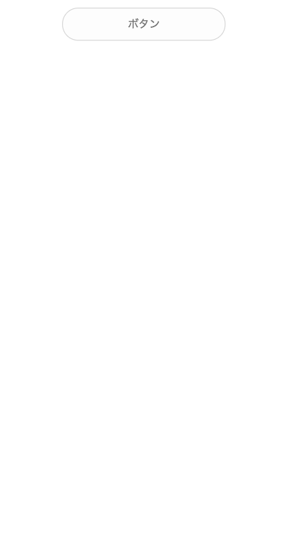

# Button

button sample using css




## requirement
* nodebrew 
* node

### version
```
$ node --version
v8.9.3
$ nodebrew --version
nodebrew 0.9.6
```

## preparation
### pre preparation
```
npm init
npm install scss node-sass nodemon
```

* scss
* node-sass ... Sassファイルをコンパイルするひと
* nodemon ... ファイルウォッチャー

### build scss
```
# 単発実行
npm run build-css

# 変更を監視してcssを作る
npm watch-css
```

## lerning
### 配置
table > table-cell で配置することで、`margin: 0px auto;`による中央寄せが適用される

### 上下左右の中央寄せ
`display: table-cell;`を行うことで、`vertical-align: middle;`が有効になる
